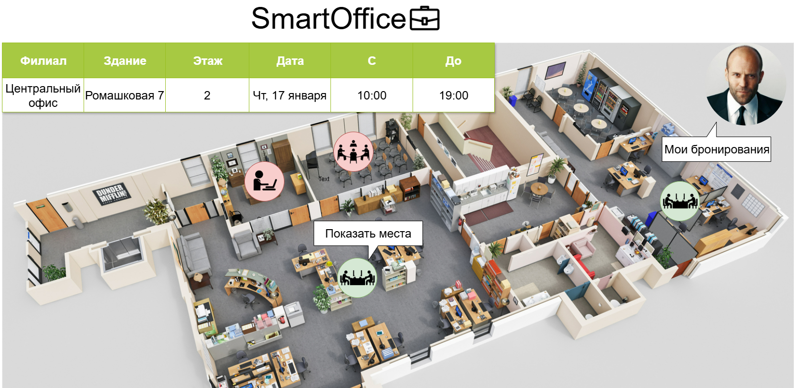

# 202505-ok-smartoffice

Учебный проект курса, поток 2025-05.

SmartOffice - это Desk-Sharing система для поиска и резервации рабочих мест на предприятии. Узнавай, кто сегодня в офисе, и бронируй рабочее место, переговорные и другие ресурсы офиса для себя и своей команды!

## Визуальная схема фронтенда
Список бронирований сотрудника:

Бронирование переговорок и просмотр помещений на этаже:

Поиск места:

## Документация

1. Маркетинг и аналитика
    1. [Целевая аудитория](./docs/01-biz/01-target-audience.md)
    2. [Заинтересанты](./docs/01-biz/02-stakeholders.md)
    3. [Пользовательские истории](./docs/01-biz/03-bizreq.md)
2. Аналитика:
    1. [Функциональные требования](./docs/02-analysis/01-functional-requirements.md)
    2. [Нефункциональные требования](./docs/02-analysis/02-nonfunctional-requirements.md)
3. DevOps
4. Архитектура
5. Тесты
   1. [Тестовые кейсы](./docs/05-testing/01-test-list.md)

